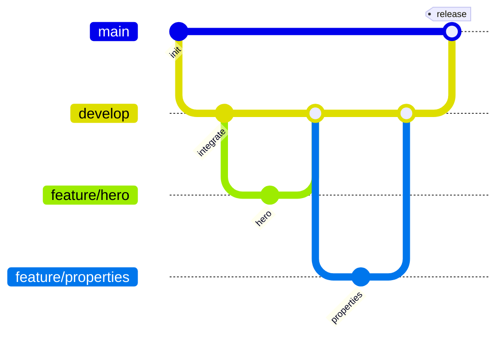

# Git Flow — Hadzhalov Estate

## Гілки

| Гілка | Призначення |
|--------|-------------|
| `main` | Здана / релізна версія |
| `develop` | Збірка всіх завершених секцій |
| `feature/*` | Розробка однієї секції |
| `fix/*` | Виправлення багів (від `develop`) |

## Порядок розробки секцій (рекомендований)

1. `feature/design-system` — `css/base/`, `css/components/`
2. `feature/header`
3. `feature/hero`
4. `feature/services`
5. `feature/properties`
6. `feature/testimonials`
7. `feature/faq`
8. `feature/cta`
9. `feature/footer`

Кожен етап завершується **Pull Request** у `develop`.

## Приклад PR

**Заголовок:** `feat(properties): картки чотирьох ЖК`

**Опис:**
- Додано семантичну розмітку списку ЖК
- Підключено локальні зображення з `assets/`
- Стилі в `css/sections/properties.css` за токенами Figma

**Test plan:**
- [ ] Відображення в Chrome / Firefox / Edge
- [ ] Адаптив 390px / 768px / 1440px
- [ ] HTML без критичних помилок у W3C Validator
